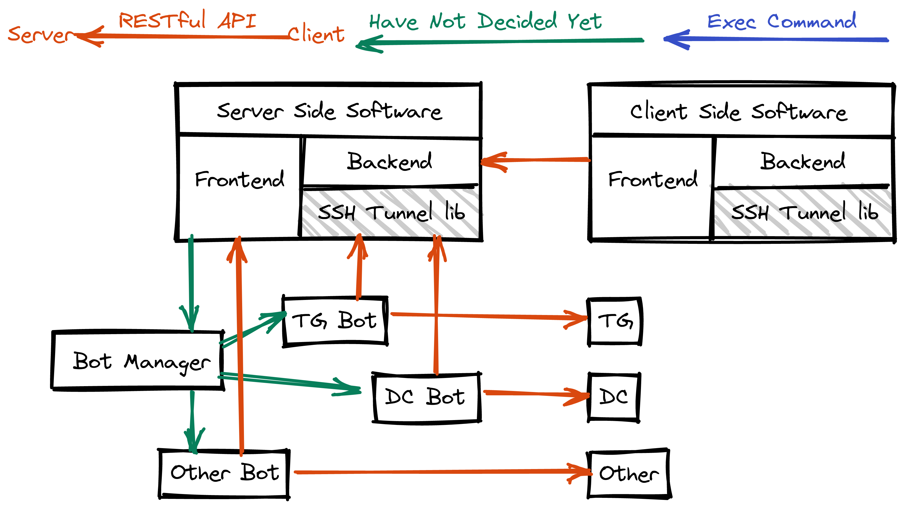

# docs
Document of this project

# stl (ssh tunnel lib, core library) usage
```
SSH Tunnel Lib Usage
stl connect <port>         -- establish ssh tunnel
stl disconnect <port>      -- disconnect
stl key                    -- return ssh publish key(stdout)
stl key renew              -- generate a new pair of key, replace the old one
stl key add <key>          -- add a ssh public key (only exec in server side)
stl status [key]           -- get status(on/off, uptime, reconnect times) according to ssh key (for server)
stl status                 -- set status (client)
```

# 架構圖


# 流程圖

